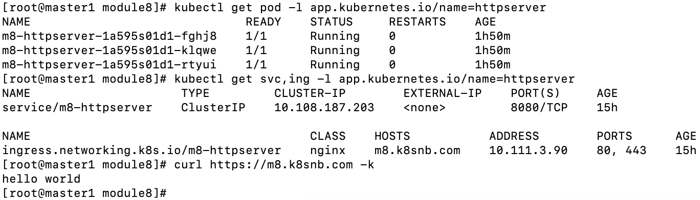

1、编写 Kubernetes 部署脚本将 httpserver 部署到 Kubernetes 集群。

* 优雅启动: deploy/deployment.yaml postStart
* 优雅终止: deploy/deployment.yaml preStop
* 资源需求和 QoS 保证: deploy/deployment.yaml resources
* 探活: deploy/deployment.yaml livenessProbe
* 日常运维需求，日志等级: httpserver/conf/config.yaml log
* 配置和代码分离: httpserver/main.go

2、将服务发布给对内和对外的调用方。

* Service: deploy/service.yaml
* Ingress: deploy/ingress.yaml
* 确保整个应用的高可用
* 通过证书保证 httpServer 的通讯安全: deploy/tls-secrets.yaml

`kubectl create -f deploy`

